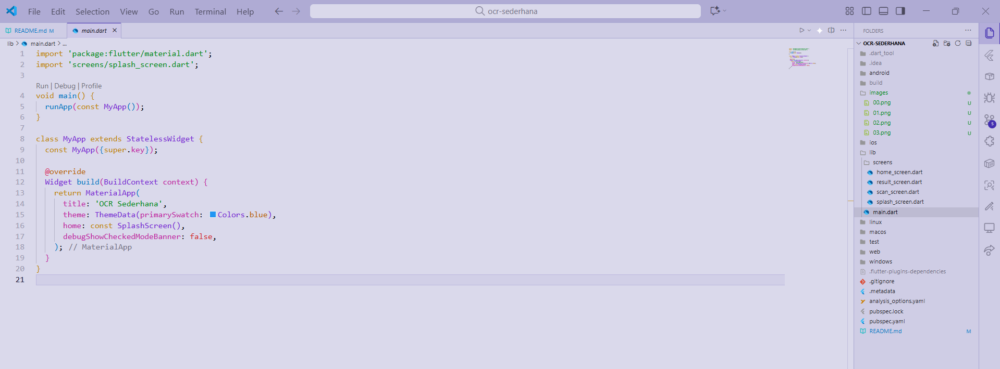

# LAPORAN PRAKTIKUM APLIKASI OCR
## LANGKAH KERJA
### Langkah 1: Buat Proyek Baru
  
### Langkah 2: Tambahkan Plugin
  
### Langkah 3: Tambahkan Izin Kamera (Android)
  
### Langkah 4: Buat Struktur Folder
  

## KODE PROGRAM
### File: lib/main.dart
  
### File: lib/screens/splash_screen.dart
  
### File: lib/screens/home_screen.dart
  
### File: lib/screens/scan_screen.dart
  
  
### File: lib/screens/result_screen.dart
  

## TUGAS PRAKTIKUM
### Jalankan Aplikasi Pada Emulator atau Device
  

## Pertanyaan
### a. Apakah semua teks terbaca dengan akurat? Mengapa?
- Ya, teks terbaca dengan sangat akurat. Hasil OCR berhasil mengenali hampir semua kata dengan benar. Alasan teks dapat terbaca dengan akurat karena: 1. Teks tulisan cukup rapi dan konsisten; 2. Foto diambil dengan pencahayaan yang cukup terang; 3. Resolusi gambar cukup tajam untuk diproses

### b. Apa kegunaan fitur OCR dalam kehidupan sehari-hari?
- Membantu mengubah dokumen kertas (misalnya surat, kwitansi atau dokumen arsip) menjadi file teks digital.
- Dapat menyalin teks dari foto, papan pengumuman, buku, dll.
- Memudahkan penerjemahan teks dari gambar atau foto bahasa asing.

### c. Sebutkan 2 contoh aplikasi nyata yang menggunakan OCR!
- Google Lens (Dapat scan dan terjemahkan teks secara real-time)
- CamScanner / Microsoft Office Lens (Scan dokumen fisik menjadi PDF digital)